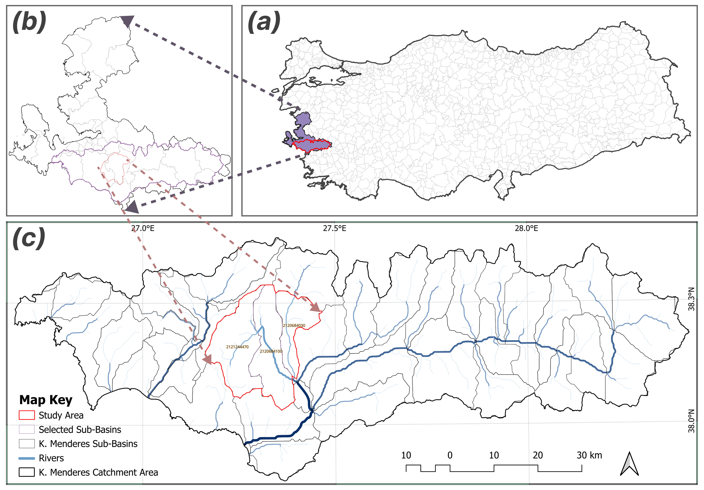

# Rapid Flood Extent Mapping and Exposure Assessment — Küçük Menderes Basin (Sep 2024)

**Repository:** `kucuk-menderes-flood-extent-2024`  
**Scope:** Cloud-native workflow for flood-extent mapping and exposure assessment using Sentinel-1/2, Google Earth Engine (GEE), and classical ML (RF/SVM/CART) for the Küçük Menderes Basin, Izmir (Sep 2024).

> Code runs in Google Earth Engine (JavaScript) and Google Colab (Python).  
> Data products and figures are released under **CC BY 4.0**; code is released under **MIT**.


*Figure 1. Study area.*

This study provides a cloud-native workflow for rapid flood-extent mapping and exposure assessment in the Küçük Menderes Basin (Türkiye). Sentinel-1 SAR and Sentinel-2 optical data are processed in Google Earth Engine to build a high-resolution LU/LC baseline and delineate inundation using four complementary detectors: event-specific SAR log-ratio thresholding, MNDWI > 0 (after masking permanent water), an Otsu-derived SAR edge mask with shoreline buffering, and a supervised Random Forest model. The LU/LC model attains 98.39% overall accuracy and the RF flood map 97.43% overall accuracy with a high F1 for the water class; intersecting inundation with demographic and land-use layers yields ~48,264 residents and ~523 ha of cropland within the mapped extent. The pipeline applies slope/permanent-water masks, reports all thresholds via histograms, and is designed for transparent, reproducible, near-real-time use; limitations include the lack of in-situ validation and urban radar artefacts (layover/double-bounce). 


*Figure 12. CFEVI results.*

---

## What's here

- `gee/` — GEE JavaScript scripts (LULC mapping; SAR log-ratio threshold; MNDWI & Otsu; flood exposure overlay).
- `colab/` — Python script for hyper-parameter tuning & ROC analysis.
- `data/` — CSV summaries of model tuning, validation scores, and CFEVI values.
- `figs/` — PNG figures used in the study.
- `other/` — Bibliography and ancillary files.

## Quick start

### 1) LULC in GEE (RF/SVM/CART)
1. Open **GEE Code Editor** and create a script from `gee/lulc_rf-svm-cart_hypertune_normidx.js`.
2. Set **AOI** and **asset IDs** where marked `// TODO: UPDATE_ME`.
3. Run to produce the **2024 Aug–Sep** LULC (RF retained).
4. Export results to your GEE Assets (GeoTIFF recommended).

### 2) Flood-extent & exposure
- **SAR log-ratio** with **~1.40** linear threshold (`gee/s1_log_ratio_flood.js`).
- **MNDWI > 0** after permanent-water masking and **Otsu** on SAR-derived edges (`gee/otsu_mndwi.js`).
- **Exposure overlay** combining flood masks with population or LULC (`gee/simple_flood_exposure.js`).

### 3) Hyper-parameter tuning & ROC (Colab)
- Upload `colab/hyperparameter_roc.py` **or** adapt into a notebook.
- Provide CSVs (RF grid, SVM grid, CART sweep, sampled normalized parameters) as in the script header.
- Outputs: heatmaps/curves (top row) + 10-fold ROC panels (bottom row).

## Reproducibility keys (event specifics)

- **Dates:** LULC composite **Aug–Sep 2024**; flood window **10–14 Sep 2024**.
- **Masks:** Permanent water (JRC GSW); slope **> 5%** removed (HydroSHEDS).
- **Thresholds:** SAR log-ratio ≈ **1.40** (linear); **MNDWI > 0**; Otsu cut **−0.1243**.
- **ML flood:** **RF (50 trees)**, 910 labels, **80/20 split**; metrics reported with 10-fold ROC.
- **Exposure:** HRSL population overlay + RF LULC.

## Data availability

- **Public sources:** Sentinel-1/2 (Copernicus), JRC Global Surface Water, HydroSHEDS, HRSL.
- **Derived rasters** (LULC, flood masks per detector, CFEVI) will be shared via DOI archive upon publication; until then, request via Issues or email (see below).

## How to cite

```
@article{Eminoglu&Erdin2025_KMB_Flood,
  title   = {Rapid Flood Extent Mapping and Exposure Assessment using SAR and Machine Learning in the Küçük Menderes Basin, Türkiye},
  author  = {Yusuf Eminoğlu and Hilmi Evren Erdin},
  year    = {2025},
  journal = {Natural Hazards},
  note    = {Preprint / In review. Repository: kucuk-menderes-flood-extent-2024}
}
```

A `CITATION.cff` is provided for GitHub citation support.

## License

- **Code:** MIT (see `LICENSE-MIT`)
- **Data & figures:** CC BY 4.0 (see `LICENSE-CC-BY-4.0`)

## Contact

- Maintainer: **Yusuf Eminoğlu** — yusuf.eminoglu@deu.edu.tr
- Please open Issues for bugs, questions, or data requests.
